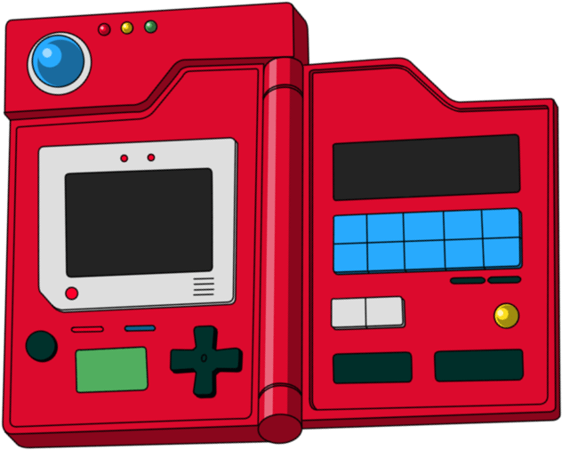

# My PockétDex

<h1 align="center">
  
</h1>

     
  <a href="#-tecnologias">Tecnologias</a>&nbsp;&nbsp;&nbsp;|&nbsp;&nbsp;&nbsp; 
  <a href="#-projeto">Projeto</a>&nbsp;&nbsp;&nbsp;|&nbsp;&nbsp;&nbsp;  
  <a href="#memo-licença">Licença</a>      

                     
                                                          
                          

                                                 
            

  
  
  
  
          

       

   

## 💻 Projeto

Projeto iniciado como o initúito de desenvolver uma aplicação web integrada com a pokéAPI.

 

## :memo: Licença

Esse projeto está sob a licença MIT. Veja o arquivo [LICENSE](LICENSE.md) para mais detalhes.

---

Feito com com 💜 por Thiago Alves.
